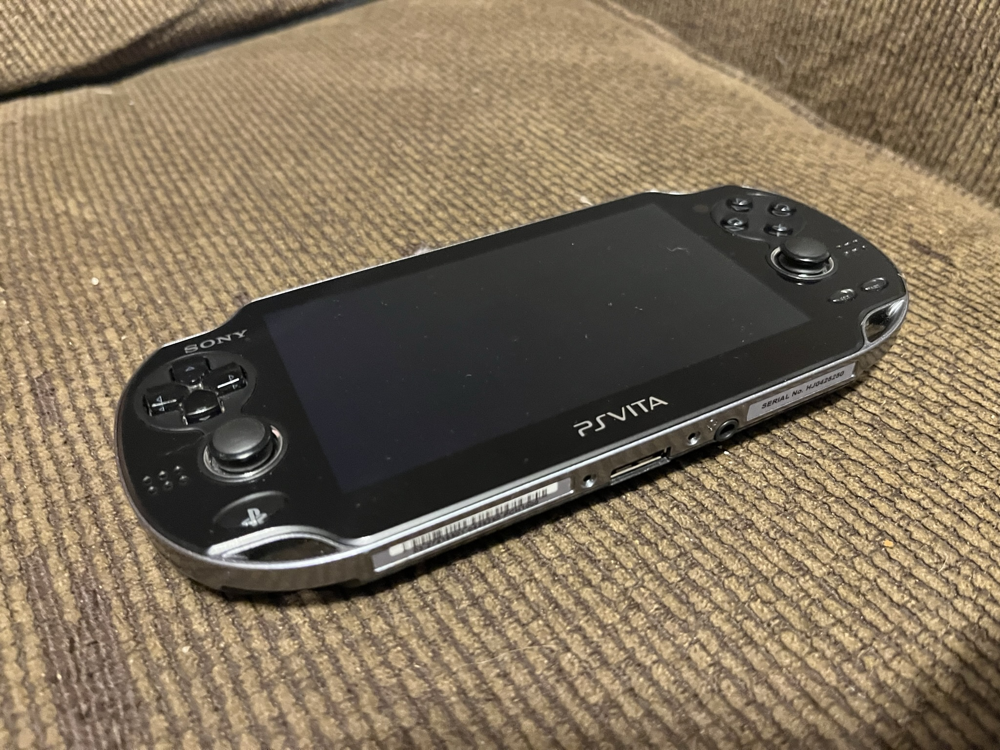

# Some stuff related to the PS Vita
Miscellaneous pwsh scripts for PS Vita stuff  
(Written in pwsh7; Windows only ships with 5.1 as of writing, but pwsh7 is super easy to install~)  

## PS Vita Game/App Lister

Usage: `.\VitaLister.ps1 -GamePath '[app]' -GameTSV [PSV_GAMES.tsv]`  
***`-GameTSV` is optional if `PSV_GAMES.tsv` located in the same directory!**  
Written in PowerShell 7, might work on 5.1.  
Requires a valid PSV_GAMES.tsv file.

Shotout to [AzimovParviz's](https://github.com/AzimovParviz) [PSVitaGameLister](https://github.com/AzimovParviz/PSVitaGameLister) for inspiring this <s>blatant ripoff</s>
### In memory of my beloved PS Vita OLED model...
I wrote this because I wanted to recover the list of games installed on my PS Vita's microSD card after ~~it died~~ the battery failed.  

  </img> 
  <b><s>RIP 2017-2023</s> Never mind, it just needed a new battery</b>

